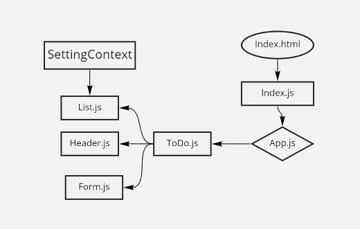

# todo-app

## Author : Sukina AbuHammad

### an application designed for creating and organizing a “To Do” list in your browser.

### Technical Requirements :
  * The application will be created with the following overall architecture and methodologies

     1. React
     2. ES6 Classes
     3. Settings delivered to the application using Context
     4. User Login & Permissions delivered to the application using Context
     5. Local Storage / Cookies for storing login status
     6. React Bootstrap for styling

### Phase 1: Application Setup 
  * Basic To Do List Management, using Hooks

### PULL REQUEST :
  ### Lab 31 :
  [pull request](https://github.com/Sukina12/todo-app/pull/2)
  
  ### Lab 32 :
  [PullRequestLab32](https://github.com/Sukina12/todo-app/pull/3)
  
  ### Lab 33:
  [pullRequestLab33](https://github.com/Sukina12/todo-app/pull/4)

### UML:

### Deployment:
[My URL](https://todo-app-sukina.netlify.app/)

